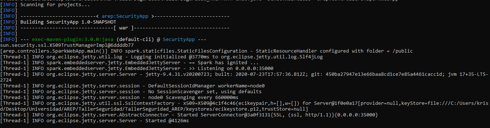

# Taller Seguridad AREP

## Estructura

## Autorización

La autorización se logra a través del uso de las llaves del certificado SSL y la TrustStore que se generan con la herramienta Keytool

## Autenticación

Para implementar la autenticación se creo una clase llamada Login, en donde se encuentran algunas credenciales de usuarios quemadas en el codigo y en donde adicionalmente se compara si concuerdan el nombre de usuario y la contraseña que fueron ingresados por un usuario de la aplicación. Adicionalmente en esta clase se toma la contraseña que ingresa el usuario de la aplicación y se le aplica una función de hash para que se garantice su seguridad

## Funcionamiento en local

Se ejecutan el servicio de de operaciones matemáticas y el servicio en donde se encuentra el login

Se prueba el login existoso

Se prueba el login fallido 

Cuando se intenta acceder a los servicios de operaciones matemáticas sin haber hecho login antes aparece un error indicando que se debe autenticar 

Cuando se hace el login de manera exitosa se puede acceder al servicio de operaciones matemáticas

Respuesta de los servidores

